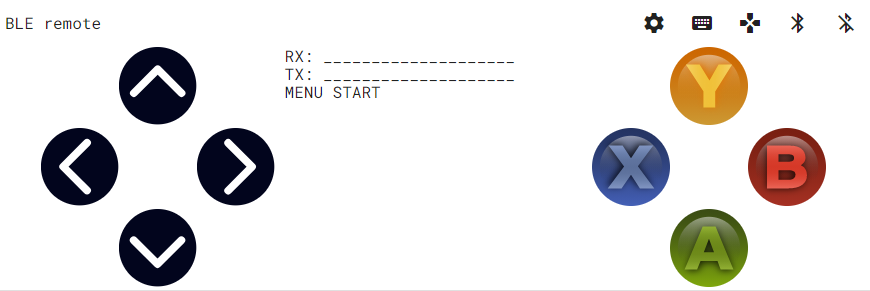

# BLE remote from a browser (laptop or phone)

Inspired by the project [https://loginov.rocks/Web-Bluetooth-Terminal/](https://loginov.rocks/Web-Bluetooth-Terminal/) that is described in detail [on github](https://gist.github.com/loginov-rocks) and [medium](https://medium.com/@loginov_rocks/how-to-make-a-web-app-for-your-own-bluetooth-low-energy-device-arduino-2af8d16fdbe8) this project provides a BLE remote for Arduino robots.

# Terminal and Remote for Bluetooth Low Energy 

- [Simple terminal](docs/simple/)
- [Progressive Webapp](docs/loginov/)
- [Analog controller](docs/analog/)
- [Digital controller](docs/digital/)

The digital controller looks like this:

The idea is to program a controller for students that don't have a smartphone (can use their laptop) and in general no need to install a software. Probably it is easier to create a WiFi hotspot and use a local website on the ESP32 instead. Then it would be compatible with Apple products as well.

## Layout

The layout should follow the keys from the [BitBlue](https://apps.apple.com/us/app/bitblue/id1403675953) iOS app from BitBus for BLE connections. We have 4 buttons for direction, four buttons for interaction and two more buttons: Start and Select.

### Key assignment

The transmitted letters are assigned as follows:

- Up - 'U'
- Down - 'D'
- Left - 'L'
- Right - 'R'

## Source code used

### Progressive WebApp

This interface is a copy of Danila Loginov and his [Github repository](https://github.com/loginov-rocks/Web-Bluetooth-Terminal).

### Analog controller

It uses the [html controller project from Yoann Moinet](https://github.com/yoannmoinet/nipplejs) that really looks and works great.

## Compatibility of Web Bluetooth in the Browser

Unfortuanely Web Bluetooth is not yet supported by Safari, iOS or macOS as of 2020. Several emails with consideration have been added to the mailing list since 2015, but the status at the end of 2020 looks like this:

You can look at an [updated overview here](https://caniuse.com/web-bluetooth).

## History

The project started in December 2019 and the digital controller was finished in February 2020. With the limitations the analog one will not be finished but the time instead be focused on a local website served by the ESP32 as a AP.

