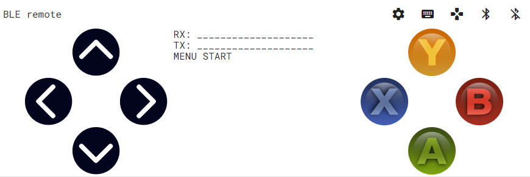
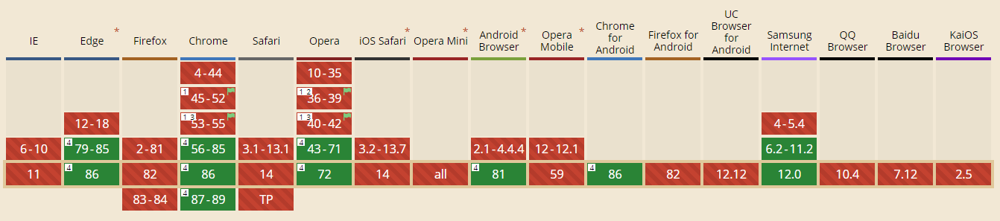

# Terminal and Remote for Bluetooth Low Energy 

- [Simple terminal](./simple/)
- [Progressive Webapp](./loginov/)
- [Analog controller](./analog/)
- [Digital controller](./digital/)

The digital controller looks like this:

The idea is to program a controller for students that don't have a smartphone (can use their laptop) and in general no need to install a software. Probably it is easier to create a WiFi hotspot and use a local website on the ESP32 instead. Then it would be compatible with Apple products as well.

## Source code used

As of November 2020 I only managed to create the simple interface and extend loginov's progessive webapp to the digital controller. Further work would be implemented in the webpage, served by the robot itself.

### Progressive WebApp

This interface is a copy of Danila Loginov and his [Github repository](https://github.com/loginov-rocks/Web-Bluetooth-Terminal).

### Analog controller

It uses the [html controller project from Yoann Moinet](https://github.com/yoannmoinet/nipplejs) that really looks and works great.

## Compatibility of Web Bluetooth in the Browser

Unfortuanely Web Bluetooth is not yet supported by Safari, iOS or macOS as of 2020. Several emails with consideration have been added to the mailing list since 2015, but the status at the end of 2020 looks like this:

You can look at an [updated overview here](https://caniuse.com/web-bluetooth).

## History

The project started in December 2019 and the digital controller was finished in February 2020. With the limitations the analog one will not be finished but the time instead be focused on a local website served by the ESP32 as a AP.

